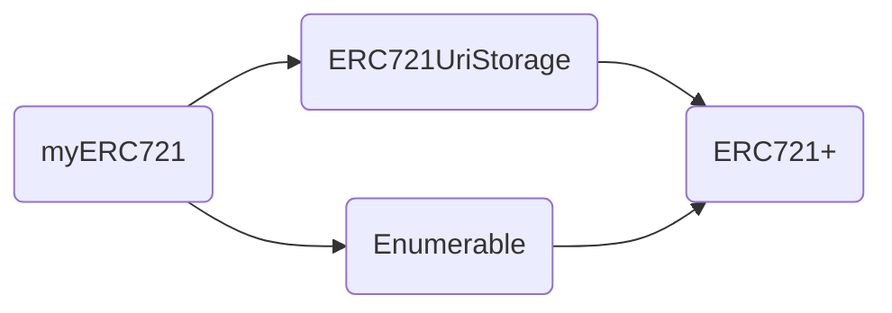

# 项目搭建

## 环境搭建：

- Hardhat
- react

## 钱包与合约访问

- wagmi
- metamask
- Ethersjs

---

- 编译合约：
  `npx hardhat compile`
- 开启本地网络：
  `npx hardhat node`
- 在本地网络上测试合约：
  `npx hardhat test --network localhost`
- 在本地网络上部署合约：
  `npx hardhat ignition deploy ./ignition/modules/ERC20Token.ts --network localhost`

---

开启前端服务：
`npx run dev`

## 合约

- 非同质化 token
- ERC721 规范

  - balanceOf 返回拥有者拥有的 token 数量
  - ownerOf tokenId => owner

- NFT 设计

  - 在之前 MyERC721 基
    以扩展
  - 增加 mint 铸币功能
  - 正确实现 tokenURI



# Sample Hardhat Project

This project demonstrates a basic Hardhat use case. It comes with a sample contract, a test for that contract, and a Hardhat Ignition module that deploys that contract.

Try running some of the following tasks:

```shell
npx hardhat help
npx hardhat test
REPORT_GAS=true npx hardhat test
npx hardhat node
npx hardhat ignition deploy ./ignition/modules/ArtistNFT.ts
0x9fE46736679d2D9a65F0992F2272dE9f3c7fa6e0
```
